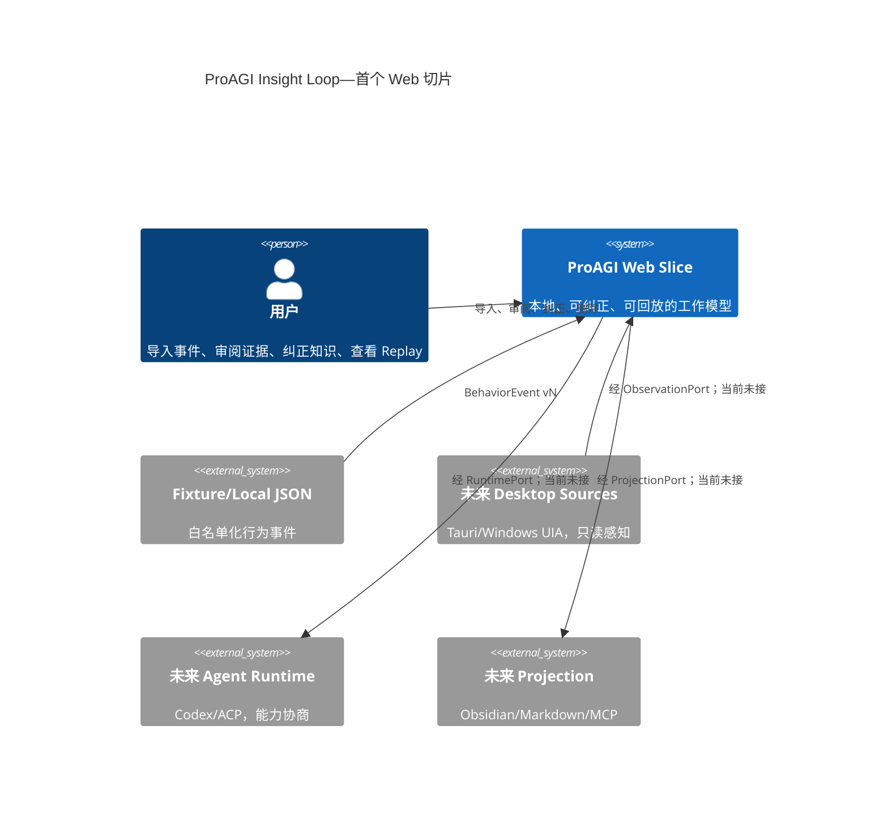
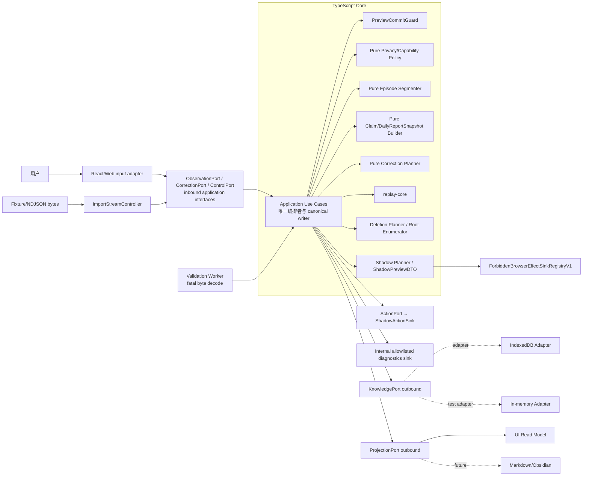
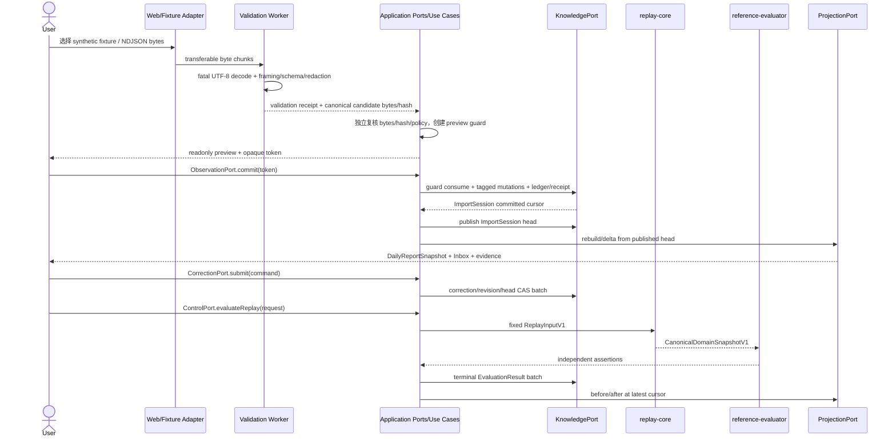

# ProAGI Insight Loop 架构
- 产品：ProAGI Assistant
- 状态：首个 TypeScript/Web 垂直切片的约束性架构
- 目标环境：Node.js + npm 可用；Rust、Cargo、Tauri 不可用
- 一致性基线：`docs/research/deep-research-report.md`、`findings.md`
- 产品边界：验证“用户纠正后，同类知识错误不再发生”，而非验证桌面自动执行
## 1. 架构目标与非目标
### 1.1 首个切片目标
用纯 TypeScript 和浏览器 UI 打通以下闭环：
1. 导入白名单化的 fixture/local JSON 行为事件。
2. 写入前校验、归一化、脱敏。
3. 将事件确定性分段为 Episode。
4. 生成 Daily Engineering Report 与带证据的 WorkModelClaim 候选。
5. 用户执行 accept/edit/reject/delete。
6. 每次纠正产生不可变 revision 与完整 lineage。
7. 对同类输入 replay，展示纠正前后差异与确定性 hash。
8. 以六态 Orb 表达处理、建议、错误和隐私状态。
### 1.2 明确非目标
- 不采集真实全局键鼠，不注入鼠标键盘。
- 不持续截图；首切片 Raw Screenshot At Rest 必须为 0 bytes。
- 不保存剪贴板正文、键击内容、完整文档正文或默认完整路径。
- 不连接云模型或外部服务。
- 不实现真实 Skill 执行；“执行”只生成 Shadow Suggestion/Action Intent。
- 不接 Tauri、Rust、Windows UIA、Codex、ACP、MCP、Obsidian。
- 不实现复杂 DAG、向量数据库、微服务、分布式事件总线或完整 Event Sourcing。
- 不将 synthetic fixture 的通过解释为真实用户价值已验证。
## 2. 架构原则
1. **领域语义优先**：领域对象不泄漏 React、IndexedDB、Tauri、UIA 或 Runtime 协议类型。
2. **事件优先、数据最小化**：只允许 schema 白名单字段进入 canonical store。
3. **候选不等于事实**：推断只能创建候选，用户纠正后才形成新的知识 revision。
4. **历史不可覆盖**：纠正追加 revision；不得原地修改旧知识版本。
5. **Canonical 与 Projection 分离**：UI、Markdown、Obsidian 均为可重建投影。
6. **确定性优先**：同输入和同版本 pin 必须得到同 canonical hash。
7. **权限 fail-closed**：能力未知、策略缺失、校验失败或来源不明时拒绝。
8. **适配器可替换**：先用 in-process/browser adapter，未来替换边缘而不改领域。
9. **不过度工程化**：单进程模块化单体；同步调用为主，必要处使用内部领域事件。
10. **实验传输不冻结**：Codex WebSocket 是 experimental/unsupported，不作为稳定接口。
## 3. C4 上下文图

## 4. 容器与组件图

**部署形态**：首切片为一个 Web 应用进程/页面；Core 与 Adapters 以 npm workspace 或源码模块分层，不是网络服务。内部接口是 TypeScript contract，不承诺 HTTP、WebSocket 或 JSON-RPC 稳定性。Application 是唯一 writer；Worker、UI、Projection、Shadow renderer、recovery worker 和 adapter 均不得直接修改 canonical store。
## 5. 领域边界
### 5.1 Observation（观察）
职责：接收外部记录，完成结构校验、字段白名单、时间归一化、敏感字段剔除和去重。
只产出 `BehaviorEvent`；不得推断长期知识。
### 5.2 Sensemaking（理解）
职责：从事件构造 `Episode`、`DailyReportSnapshot`、`Question` 与 `WorkModelClaim` 候选。
所有推断必须引用 `EvidenceRef`，并标记 `inferred`，不能伪装成 observed。
### 5.3 Knowledge & Correction（知识与纠正）
职责：维护 claim 状态、scope、证据、反证、不可变 revision 及 correction lineage。
它决定 accept/edit/reject/delete 的语义，是核心业务真相。
### 5.4 Evaluation（评估与 Replay）
职责：在版本 pin 下重放固定输入，断言最终领域状态，计算 canonical hash 和纠正吸收指标。
不得以 UI toast、点击轨迹或模型自报作为成功依据。
### 5.5 Presentation & Projection（呈现与投影）
职责：将 canonical state 派生为页面 read model、导出文件或未来 Obsidian 文档。
投影可删除并重建，不得反向成为隐式 Source of Truth。
### 5.6 Action & Runtime（动作与计算）
首切片仅生成 `ActionIntent`/Shadow Suggestion，不产生外部副作用。
未来真实执行和 Runtime 调用只能通过端口进入，不能侵入上述领域对象。
## 6. 最小领域模型
Schema、状态机、ID/hash 与排序的唯一规范源是 SPEC；本节不复制枚举。
| 对象 | 必需语义 |
|---|---|
| `BehaviorEvent` | SourceRef、白名单字段、PrivacyDecision、source-stable dedupeKey、non-unique factHash、provenance/content hash |
| `Episode` / `EvidenceRef` | final Episode 与只指 immutable revision 的 typed/hash evidence；删除时物理处理引用者 |
| `WorkModelClaim` | 每个对象即 immutable revision；claimKey/semanticKey、parent、predicate/scope/evidence/status |
| `CorrectionCommand` / `CorrectionRecord` | command 瞬时；record 创建时即 applied/failed 终态且 append-only |
| `KnowledgeVersion` / `KnowledgeHead` | version immutable；独立 head 以 expectedContentHash CAS，不原地标 current/superseded |
| workflow revision / head | Question、SkillCandidate、ActionIntent 每次状态变化追加 revision并 CAS head |
| Consent/Retention | immutable ConsentGrant + ConsentRevocation；RetentionPolicy 单独生命周期 |
| Store control | StoreMeta 四字段、CommitLedger/change feed、active deletion controls 与随机 verified receipts |
| `EvaluationRun` / `EvaluationResult` | run 仅内存；持久 result 直接 terminal，使用 InputIdentity/VersionPins；删除时移除 payload |
`DailyReportSnapshot` 仅为 sourceCursor 投影缓存。Business/System lifecycle、hash 和 DTO 均以 SPEC 为唯一来源。
## 7. Application Ports / Adapters
方法签名、DomainResult/ErrorPolicy 与 operation-capability-scope 名称以 SPEC 为唯一规范；本节只冻结方向、所有权和编排，不复制 enum。

### 7.1 Inbound application ports
| Port | 正式 use cases | 责任 |
|---|---|---|
| `ObservationPort` | `preview`、`commit` | 接受 inline/stream input；返回 opaque preview；commit 必经 PreviewCommitGuard |
| `CorrectionPort` | `submit` | 普通 correction 原子生成 revision/head；action=delete 只启动 recovery-fenced deletion，linked terminal 仅临时存在并在 Tv 前删除 |
| `ControlPort` | `pausePrivacy`、`resumePrivacy`、`revokeConsent`、`recover`、`retryPurge`、`clear`、`evaluateReplay`、`export` | 唯一的隐私、恢复、清除、Replay 与导出编排入口；UI/CLI/MCP 不得自行拼装这些步骤 |

`ControlPort` 是 application inbound contract，不是第七个基础设施 adapter。`evaluateReplay` 分页构造固定输入、调用纯 `ReplayV1`，以独立 evaluator/gold assertions 得出 terminal EvaluationResult 并由 Application 持久化；`export` 显式确认后调用 `ProjectionPort.export`，Shadow 路径不可达。privacy/recovery/retryPurge/clear 均双检最新 meta、lease、generation 和 cursor。

### 7.2 Outbound driven ports
| Port | 方向与职责 | M1 实现 | 未来边界 |
|---|---|---|---|
| `KnowledgePort` | snapshot/page/change、PreviewCommitGuard、tagged mutation、lease/journal 与原子 commit | InMemory / IndexedDb adapters | SQLite adapter |
| `ProjectionPort` | sourceCursor-CAS rebuild/export | WebProjectionAdapter | Markdown/Obsidian adapter |
| `ActionPort` | Shadow-only ActionIntent/ShadowPreviewDTO | ShadowActionSink | 新动作 PRD 后才可扩展 |
| `RuntimePort` | typed initialize/submit/result/cancel | M1 不实例化 | Codex/ACP adapter |

Application 是唯一编排者与 canonical writer。所有 business/system write、head publish、guard consume、ledger/change、delete/recovery、EvaluationResult 和 ExportReceipt 均只能由 Application 构造平台中立 mutation 后交 KnowledgePort；adapter 只能原子映射，不能自行生成领域事实。Worker、UI、Projection、reference evaluator、Shadow renderer 与 recovery scheduler 都没有写权限。

每次 application 调用传播 caller、resource scope、purpose/policy、epoch、correlation、intent/idempotency、deadline 与适用 consent；具体字段和取值只引用 SPEC。入口授权与 commit guard 双检，禁止 confused deputy。

### 7.3 PreviewCommitGuard 线性化
`ObservationPort.preview` 在短期隔离 buffer 中保存原始 source bytes，并写/返回只含 opaque token 的 guard identity。`ObservationPort.commit` 必须在一个短事务中完成：

1. 校验 token hash、未消费状态、input identity/hash、source-buffer hash、pins、consent/retention、privacyEpoch、mode、TTL 与 expected cursor；
2. 校验准备好的 tagged mutations 与 batch hash；
3. CAS 将 guard 标为 consumed；
4. 应用 mutations，写 CommitLedger/change feed/receipt 并推进 cursor。

任一步失败整个事务零写；同 token 跨标签竞争只能一方成功。source buffer 缺失、字节变化或 guard 已消费一律 fail closed。事务提交后清除 buffer；崩溃恢复按 guard/ledger 判定已提交或可重试，不凭 UI 状态猜测。

## 8. 数据流


Worker 只负责字节 framing、fatal decode、schema/allowlist/redaction validation 和候选 hash，不决定 canonical commit。Application 必须独立重算 canonical bytes/hash、构造 tagged mutations并决定 commit；Worker 自报 accepted/hash 不能直接写库。

大输入由 `ImportSession` 隔离：每个提交 batch 可持久化到 session staging，但在完整 footer/count/hash 验证与所有 batch ledger 对齐前，session head 不得 publish，Sensemaking/Projection/Replay 不可见。成功由 Application 原子发布 head；取消/截断默认删除 staging，若保留部分导入必须再次显式预览确认并发布为新的完整 session。`ImportStreamController.dispose` 必须释放 reader、Worker、listeners、timers、object URL 与 buffers。

Application 只提交平台中立 tagged mutations；IndexedDB adapter 才负责预开 stores、排队 requests和事务内 meta/ledger/change/head CAS。普通 correction batch 必须原子；delete 进入 §9 recovery-fenced protocol。
## 9. Canonical Store、Projection 与原子 mutation
### 9.1 Canonical Store
M1a 使用 memory adapter；M1b 起使用 IndexedDB，均封装在 `KnowledgePort` 后并通过同一 contract suite。

Canonical 数据只包含 SPEC registry 中批准的 live business/system records。普通 accept/edit/reject/restore 的 terminal CorrectionRecord、immutable revisions/versions/heads 可长期存在；delete command 的 linked terminal、plan、ledger/change refs 与 recovery metadata 只在 fenced recovery scope 临时存在，必须在 verified 前清除。`DailyReportSnapshot` 仅为可丢弃 projection cache；DOM/React/HTML、原始截图、Runtime 原流和 projection 文件不是 canonical truth。

### 9.2 Tagged mutations 与 reserve accounting
Application 只能构造封闭 tagged mutations：`insertImmutable`、`casSingleton`、`deleteIfHash`、`casProjectionHead`；不允许 generic put 覆盖 immutable record，也不允许 head write 缺 expected hash。batch 明确声明 touched stores、expected cursor/epoch/modes、idempotency key、batch hash、estimated ordinary/recovery byte delta 与 estimator version。

`meta` 是线性化点。IndexedDB adapter 在同一短事务复核 guard/context、应用 tagged mutations、CAS heads、写 ledger/change并推进 cursor，同时更新 logical ordinary bytes 与 recovery bytes。普通事务不能侵占 recovery reserve；recovery transaction 只能在独立上限内写控制记录且总趋势必须净减小。估算误差、物理 quota 与 logical accounting 分别记录，任何 accounting underflow/overflow/version mismatch 均 fail closed。

最小索引与 store 集合不在 ARCH 复制，统一由 SPEC registry 生成。不同来源的等价事实必须分别保存 provenance；dedupe 只消除同来源重试。

### 9.3 Projection 与 Web Presentation
Web read model 从 canonical records 纯函数生成，可缓存但不具权威性。投影带 sourceCursor/projectionVersion 并以 CAS 发布；旧 cursor 的异步 rebuild 不得覆盖新 head。未来 Obsidian 仍是 projection，外部编辑只能转成显式 correction。

React 只消费分页/增量 read model，不读取 IndexedDB、不持有完整 entity graph。`AppShellV1` 固定 Today/Observed/Learned/Correction Impact/Inbox/Replay；详情按 entity ref 懒加载。所有写意图绑定 sourceCursor/base revision/intent generation，stale 时禁用，response loss 回读同一 ledger/receipt。

视觉与可访问契约只引用 SPEC，不复制状态 enum。DOM、accessibility tree、title/data、live announcements 与 test artifacts 都是 privacy sink；允许展示的 local-sensitive 正文仅能位于用户预期的可见正文/表单及等价 a11y text，不能进入 accessible name/description/title/data/live/hidden/log。restricted、prohibited、deleted 数据在所有 sink 中为零。

### 9.4 Deletion protocol：fence、enumerate、purge、finalize
删除采用以下不可跳过的架构阶段；具体 DTO/state 字面值仍以 SPEC 为准：

1. **Plan**：在只读 snapshot 上计算 target 与 baseline cursor/epoch/mode、registry version、root registry hash 和 plan hash，不预写任意规模 work list。
2. **T0 fence**：短事务重新读取并等值校验全部 baseline、重算 plan hash；任何变化零写并回到重新规划。成功后写最小 plan/journal、切 recovery fence、推进 cursor。
3. **FENCED enumeration**：在 fence 内按稳定 page token 分页枚举反向引用与 registry roots；每页只追加有界 work，记录 page input/output hash 和 high-watermark。enumeration 完成 seal 前不得进入 purge。
4. **Delete chunks**：每个短事务持有有效 RecoveryLease fencing token，以 delete-if-hash/idempotent work 删除目标、indexes、linked terminal CorrectionRecord、KnowledgeVersion/head、EvaluationResult、CommitLedger.affectedRefs、change-feed record refs、projection/search/import staging 与关联 audit/export metadata；work progress 与 byte accounting 同事务提交，完成的 work 随后分页移除。
5. **Purge generation**：创建 generation/cutoff；cutoff 后打开的 client 必须加入 required set 或进入 QUARANTINED，只可 purge/ACK/close，不能读旧 projection。Audit 前原子 seal membership；未 seal 不得判 ACK 完整。
6. **RetryPurge**：ControlPort 原子关闭旧 generation、证明已关闭/过期 client 不再可访问旧内存、重算 required membership 并产生新 generation；旧 generation ACK 永久无效。关闭标签不能被当作 ACK，也不能导致永久死锁。
7. **Reachability**：roots 从 `ReachabilityRootRegistryV1 + LIFECYCLE_BINDINGS + TestArtifactSinkRegistryV1` 穷尽生成，不手写静态列表。逐 root 扫描 IDB stores/indexes、ledger/change feed、preview/import session/Worker/client memory、projection/DOM/a11y/announcement/cache、diagnostics、exports 与测试 artifacts；任一漏 root、registry/hash 不符或 canary 可达都不能 clean，残留转为新 work。
8. **FINALIZING**：在 recovery fence 内分页移除 work、ACK、quarantine、linked ledger/change 和含旧 ID/hash 的 active records；每页短事务、幂等、带 lease token。全部 cleanup seal 后，最终短 Tv 只写随机无关联 verified receipts/tombstone、恢复 normal、推进 cursor并释放 lease。

Verified records 只能保留 SPEC 批准的随机、无关联字段。失证对象与相关 EvaluationResult 必须物理删除；只可从仍 live、重新满足 predicate 且 canary-clean 的证据创建无 parent 新 root。未来显式新 import 可创建全新 lineage，但不得读取旧 tombstone/cache/export。

### 9.5 RecoveryLease fencing
RecoveryLease 至少包含 owner client、lease generation、单调 fencing token、issued/renewed/expires 与 expected journal generation。获取、续租、steal 和每个 recovery transaction 都通过 meta CAS 校验 token；旧 owner 的迟到 transaction 必须失败。过期只允许新 owner 原子 steal，不等于 purge ACK。时钟不可用/回拨、token 不连续、双 owner 或 lease store 不可读时保持 recovery fence并 fail closed。

### 9.6 BroadcastChannel fallback
BroadcastChannel 仅用于低延迟通知，绝不是正确性来源。缺失或运行失败时：

- PRIVATE pause/resume 仍通过 IDB meta/epoch 线性化；其他标签的下一次 commit 因 epoch/mode 不符失败；
- clear-all 仍尝试 versionchange/connection close，blocked 时诚实停留 safe state；
- 需要跨 client purge 的 target delete 不得假装完成：进入 recovery surface，要求关闭其他标签或在可证明单 client 后由 RetryPurge 建新 generation；
- 不允许用 localStorage event、轮询或仅内存 flag 冒充等价 fence。

启动、visibility regain 与每次写前都重新读取 meta/journal/generation；遗漏通知只能影响及时性，不能影响安全性。
## 10. StoredRecord schema migration
本系统不是 Event Sourcing，不引入 `EventEnvelope/streamRevision` 第二套持久化模型。schema 与 migration DTO 以 SPEC 的 `StoredRecord`、`MigrationRegistry` 和 `Upcaster` 为唯一来源。
规则：
- `recordType + recordSchemaVersion` 唯一确定解码器；读取时按 registry 逐级执行无时钟/网络/随机的纯 upcaster。
- 旧 StoredRecord 不原地重写；迁移结果只在内存或显式 `StorageMigrationV1` 目标库中体现，并记录 before/after hash、source/target schema 和完整计数。
- 破坏性字段变化提升 schemaVersion major；算法语义变化只提升 VersionPins 中对应 component pin。
- 未知版本、缺失 upcaster、迁移 hash/计数不符一律隔离并 fail-closed。
- Adapter 外部协议版本与 StoredRecord schema 独立；provider DTO 不进入 canonical store。
## 11. Revision lineage、多标签与并发
- 每个 claim lineage 由不可变 revision 组成；Correction 必须基于当前 head，冲突禁止 last-write-wins。edit/accept/reject/restore 追加 revision/version并 CAS head；枚举与状态转换只引用 SPEC。
- delete 物理移除整个 live lineage。linked delete command/terminal、version/head、ledger/change和评估引用仅可处于 fenced recovery scope并在 Tv 前删除；normal store 最终只见随机无关联 receipts。未来显式新导入只能创建无旧 parent/head 的全新 lineage。
- 多标签共享 canonical meta；所有 commit 在同事务复核 context、guard、cursor/epoch/modes 与适用 lease/generation。冲突由用户刷新、重新预览或显式 retry use case 解决，不能静默覆盖。
- BroadcastChannel fallback、quarantine、purge membership 与 RecoveryLease 完全按 §9.4–9.6；通知不参与正确性判定。
- IndexedDB adapter 必须处理 versionchange、blocked 与连接 close；clear-all 只有数据库删除、缓存/内存/artifact 清理及 empty reopen 都成立后才成功。
- 启动顺序固定为：读取 meta/journal/lease/generation → 校验 registry/hash/lineage → 必要时调用 `ControlPort.recover` → 恢复 projection。任何不变量异常先进入安全只读或 recovery surface，不开放普通写。

## 12. 确定性 Replay 与 reference evaluator
Replay domain contract 只引用 SPEC，不在 ARCH 复制字段、enum、排序 tuple 或 Key 公式。`ControlPort.evaluateReplay` 是正式 application 入口：在一个稳定 snapshot cursor 上分页解引用 published ImportSession、live immutable observations、heads/version sets 与非删除 terminal corrections，构造完整输入并锁定 VersionPins/profile。

1. `replay-core` 是纯函数包，不访问 Store、系统时钟、网络、UI 或随机数；随机 ingress/run/record IDs 不进入语义排序/hash。
2. Application 验证 head 连续、hash、scope、pins、profile 与 snapshot cursor后调用 replay-core；cursor 改变则丢弃结果并重建输入。
3. `reference-evaluator` 位于独立包，只读 canonical replay output 与独立 gold artifact；不得 import application inference/segmenter/canonicalizer 实现。
4. Evaluator 返回 assertions；Application 才构造 terminal EvaluationResult tagged mutation并提交。reference evaluator、测试 runner 和 Replay 均无写权限。
5. 同输入必须得到相同 ReplayKey、semantic IDs 和 snapshot hash；不一致 fail closed并阻止发布。删除后的 replay builder 不得读取 linked terminal、旧 ledger/change、cache、export 或 tombstone恢复语义。
## 13. 数据分类、Consent、Retention 与威胁模型
数据处理采用 SPEC 的四级 registry：
- `public`：schema enum、粗粒度 appId/fileExt/计数；可持久化并按 policy 导出。
- `local-sensitive`：时间序列、用户别名、statement/reason/answer、scope/evidence graph；仅本地 IDB，最小展示，导出需显式确认。
- `restricted`：原始标题/路径/URL/命令、细 detector ID、可关联来源标识；只允许瞬时 preview/redaction，不进入持久层、默认 DOM 或导出。
- `prohibited`：secret、键击/剪贴板正文、像素、未授权来源；拒绝且不得进入 store/log/cache/export。

| 威胁主体/入口 | 风险 | 首切片控制 |
|---|---|---|
| 恶意/误配 fixture | secret、超长/Bidi、schema 炸弹 | 字节/深度预检、严格 schema、版本化 detector、allowlist、redaction 后二次校验 |
| 网页或用户自由文本 | XSS/prompt injection/视觉混淆 | `UntrustedUserText`、NFC/control/Bidi policy、contextual output encoding；未来 Runtime 仅接结构化 data channel |
| 同机用户/扩展/备份 | 读取 IndexedDB | 明示 local-first 不等于应用级 at-rest encryption；M1 仅 synthetic，M2 必须决定隔离/密钥或在 consent 中接受残余风险 |
| XSS/依赖污染 | 窃取 canonical data | 禁止 raw HTML；production CSP 至少 `default-src 'self'; script-src 'self'; style-src 'self'; img-src 'self' data:; font-src 'self'; connect-src 'none'; object-src 'none'; base-uri 'none'; frame-ancestors 'none'`；禁止 remote script/font、固定 lockfile、`audit:deps` 与最少依赖 |
| 用户误授权 | 来源、字段、用途或期限过宽 | 不可变 ConsentGrant、来源预览、字段清单、purpose、RetentionPolicy、撤回与 privacyEpoch |
| 删除不完整 | 缓存/导出/replay 复活 | DeletionJournal、反向索引、ReachabilityAudit、recovery-only、随机 deletion marker |
| Runtime/Skill 被攻陷 | 外传或越权 | M1 不实例化 Runtime、不执行 Skill；未来最小上下文、capability scope 与隔离 |

M1 只启用 bundled synthetic fixture 或用户专为测试准备、符合公开 schema 的本地 fixture；不得把任意真实工作日志作为“local JSON”绕过 M2 consent。M2 readonly-adapter 必须引用 active ConsentGrant：preview 与 commit 双检 grant、无 ConsentRevocation、purpose/fields/policy/retention/epoch；撤权追加 Revocation、线性化 epoch/mode，再运行删除协议。
`projectKey/branchHash` 只允许用户别名或 keyed token，禁止裸 digest、路径、组织名和仓库 URL。结构化事件不天然低敏；风险按可推断性、可关联性、保留期、用途和导出范围评估。

### 13.1 ShadowPreviewDTO 与浏览器副作用 registry
`ShadowPreviewDTO` 是 ActionIntent 的纯展示 DTO，只含固定意图标识、已脱敏 preconditions/steps/expected effect、禁止副作用类别、evidence refs 与 projection cursor；不得含可执行 callback、URL、协议字符串、下载 handle、FileSystemHandle、ClipboardItem、Request 或 provider object。正式 renderer root 为 production bundle 中唯一导出的 `renderShadowPreview(dto)`；它与 `ActionPort.submitShadow`、`ShadowActionSink` 一起构成稳定 reachability roots。

`ForbiddenBrowserEffectSinkRegistryV1` 是 Shadow 门禁的唯一 sink 来源，至少按 API family 覆盖：network（fetch/XHR/WebSocket/EventSource/sendBeacon）、navigation（window.open/location/form submit/custom scheme）、download/file（anchor download、Blob URL trigger、File System Access）、clipboard/share、Service Worker/background sync、process/OS bridge，以及能把消息转交上述能力的 Worker/iframe/custom-event bridge。新增浏览器 effect adapter 必须先登记 sink 与 test spy；未知 sink fail closed。Shadow roots 只可到纯 policy、ActionIntent/AuditEvent canonical commit 和纯 projection，不能到 ControlPort export、RuntimePort 或任何 registry sink。

`TestArtifactSinkRegistryV1` 单独覆盖 screenshot/video/HAR/trace/reporter/console/source-map/CI upload。artifact 必须在写前 redaction、隔离目录、TTL 和销毁 receipt 下运行，并纳入删除 reachability roots；测试证据不是绕过 privacy policy 的出口。

## 14. PortRequestContext、权限与 fail-closed
权限不依赖隐含 UI 身份；每次调用使用 SPEC 完整 PortRequestContext（caller、operation/capability、ResourceScope、purpose/policy、epoch、correlation/idempotency/deadline/consent）。能力名称与 operation matrix 只从 SPEC registry 生成，本文件不复制枚举；M1 policy 禁用 runtime 等未来能力而不修改核心 union。
权限决策输出 allow/deny + 固定 reason code。未知 capability、缺失/不可读 policy、scope/purpose 不明确、来源不可验证、Consent 失效、Retention 过期、privacyEpoch stale、Adapter 能力高于授权时必须拒绝。拒绝不得自动升级到更高敏方式。
PRIVATE capability matrix：拒绝 observation import、Runtime submit 和新 action suggestion；允许 knowledge.read、knowledge.delete/clear、privacy settings/resume 与 recovery。local export 仅在再次显式确认后允许。`RECOVERY_ONLY` 只允许 audit、补偿、cache rebuild、clear-all 与脱敏诊断导出；`CLEAR_ONLY` 进一步禁止普通诊断以外的业务访问。
## 15. 错误分类与恢复
| 类别 | 示例 | 策略 |
|---|---|---|
| `VALIDATION` | schema/字段/大小非法 | 拒绝输入；不重试 |
| `PRIVACY` | secret、Consent/Retention、删除违例 | fail-closed；固定安全文案和下一步 |
| `PERMISSION` | capability/context 缺失 | 拒绝；说明所需最小能力 |
| `CONFLICT` | stale cursor/revision/epoch | 不覆盖；请求刷新或显式重试 |
| `STORAGE` | quota、事务失败、损坏 | 事务内 abort；按严重度进入 inspection/recovery/clear-only |
| `DELETE_RECOVERY` | 非 verified journal、audit 失败 | 冻结普通写；journal 幂等补偿；失败后 CLEAR_ONLY |
| `DETERMINISM` | 同 key hash 不一致 | 阻止验收/发布；保留最小诊断 |
| `ADAPTER/RUNTIME` | 版本不兼容、不可用 | 隔离 adapter；M1 Core 继续可用 |
| `BUG` | 不变量破坏 | 停止普通写；显示 ERROR；允许安全恢复动作 |
错误对象使用 SPEC 稳定 ErrorCode、固定用户安全文案、correlationId、retryable 与 next-action registry。fieldPath 只能是 schema 静态 token，动态/未知 key 统一 `$unknown`；message/details/eventName 不得含输入、validator issue 或 production stack。quota 在用户释放空间前不可重试；自动重试只用于有幂等键的瞬态错误并受次数/时间预算限制。
## 16. 可观察性与 Audit
本地结构化诊断日志仅允许：timestamp、level、固定 eventName、correlationId、durationMs、resultCode、schemaVersion、algorithmPins 和粗粒度计数；不记录正文、原始 attributes、动态 key、完整路径、细 detector ID 或用户输入。
`AuditEvent` 只记录 actor、capability、固定 operation、resultCode、correlationId 和时间，不复制业务 payload或 target/content ID。普通 correction audit 可与业务 batch 原子提交；删除完成后的 audit 只能使用随机 deletion marker。Debug log 不属于 canonical state；Audit/日志有 TTL、条数和字节上限。
核心指标包括导入/拒绝/redaction/未知 schema 数、claim/evidence 完整率、correction 类型、Replay/Projection 耗时、cursor/epoch conflict、非 verified journal、补偿次数、逻辑 IDB 字节预算和删除残留。Raw Screenshot At Rest 必须为 0；网络门禁只统计 Shadow 调用图可达的未授权外部调用，不把同源静态资源、canonical IDB 或用户显式导出误算为动作。
M1 只有本地、allowlisted diagnostics sink，不设 Telemetry Port、不上传。开发模式可由 ControlPort 显式导出脱敏诊断包；未来 opt-in 遥测必须另立 sink/policy 且只能发送聚合指标。
## 17. 性能与容量预算
指标、采样和阈值的唯一来源是 EVAL §13；ARCH 不另设硬 p95。冻结基线前结果均为 `[STAT]`，不得抵消 `[INV]`。
- PR gate 跑 1k/10k 小样本、Long Task、golden 和 O(n²) 比率；nightly/release 才跑 50k、完整冷启动/30 次样本与高 fan-out。
- 普通容量预算之外始终保留独立 recovery reserve；logical ordinary/recovery bytes 与 estimator version 在每个 transaction 原子更新，物理 browser quota 单独报告。
- 大输入使用 transferable bytes + fatal Worker decoder 和有界背压；validated batches 先进入不可见 ImportSession，只有完整校验后由 Application 原子 publish。取消默认清除 staging，保留部分结果必须重新预览确认。
- UI 只加载当前 page，Replay 按 scope/window 构造输入，Projection 消费 change feed并以 sourceCursor CAS；不得把全量 DomainSnapshot 放入 React state。
- Evidence Pack 固定 Node 24.15.0/npm 11.12.1、Playwright Chromium revision、source-tree/build hash、tier、InputIdentity 与 VersionPins。空闲时无轮询/截图/网络，动画遵循 reduced-motion。
未来 Tauri 常驻目标必须在真实 Windows 机器实测后单独冻结。
## 18. 依赖规则
```text
apps/web features -> application inbound ports
apps/web composition root -> application + adapters
application -> ports + domain + replay-core
adapters -> outbound ports + domain
replay-core -> domain schema primitives only
tools/reference-evaluator -> public schemas + tests/gold-artifacts only
ports -> domain
domain -> 标准 TypeScript；不得依赖 React、浏览器 API、数据库或外部协议
```
禁止：
- `domain` import `react`、IndexedDB、Tauri API、Codex/ACP SDK。
- UI 直接读写 IndexedDB。
- Adapter 互相调用或绕过 use case 修改 canonical state。
- Projection 反向覆盖 canonical record。
- Runtime 返回值直接进入知识库而不经校验与 candidate 流程。
- 为“未来可能”提前引入 broker、ORM、DI framework 或通用 plugin framework。
用 TypeScript structural interfaces + 显式 constructor wiring 即可；只在边界使用 schema validator。
## 19. 建议目录结构
```text
apps/web/src/{app,features/{insight-inbox,replay,privacy,recovery,orb}}/
packages/domain/src/{events,episodes,claims,corrections,evaluation}/
packages/application/src/{use-cases/{import,correct,control,replay,export},guards,policies}/
packages/ports/src/{observation,correction,control,knowledge,projection,action,runtime}.ts
packages/adapters-web/src/{fixture,indexeddb,projection,diagnostics}/
packages/replay-core/src/{canonicalize,hash,replay}/
packages/schemas/src/{events,upcasters,validation}/
tools/reference-evaluator/src/{oracle,mutations,assertions}/
tests/gold-artifacts/{fixtures,gold,evaluator-manifests}/
tests/{contract,integration,invariants,e2e,visual,a11y}/
```
`replay-core` 不得依赖 application、adapters、UI、tests 或 reference evaluator；`tools/reference-evaluator` 不得 import production inference/segmenter/canonicalizer，只能依赖公开 schema 和独立 gold artifacts。依赖图 lint 必须把这两条作为硬门禁。`diagnostics` 是内部 allowlisted sink，不是 Telemetry Port。

## 20. 测试与架构门禁
- **Control/Application**：逐项覆盖 `pausePrivacy/resumePrivacy/revokeConsent/recover/retryPurge/clear/evaluateReplay/export`；断言 UI/adapter/Worker/evaluator 无直接 writer 路径。
- **Preview linearization**：伪造/过期/二次消费、source buffer 丢失/变更、双标签同 token、commit response loss；guard consume、mutations、ledger/receipt 必须同事务且只成功一次。
- **Byte stream/import ownership**：transferable raw bytes、fatal UTF-8、多字节跨 chunk、framing/hash/backpressure/cancel/crash；Worker receipt 不可直接 commit，Application 独立 hash；未 publish ImportSession 对 Sensemaking/Projection/Replay 不可见。
- **Mutation/reserve**：每个 tagged mutation 的合法/非法目标、immutable overwrite 拒绝、head 缺 CAS 拒绝；ordinary/recovery byte delta、estimator version、reserve 边界 ±1、quota/response-loss 必测。
- **Deletion baseline/enumeration**：plan→T0 间 cursor/epoch/mode/root-registry 任一变化必须零写重规划；FENCED 分页无漏重、page hash/high-watermark 固定，不能 T0 全量写 work。
- **Purge/recovery fencing**：cutoff 前后新 client、QUARANTINED client、seal race、关闭未 ACK client、RetryPurge 新旧 generation、迟到 ACK、双 recovery owner、lease renew/expire/steal、旧 fencing token transaction 全部故障注入。
- **Finalize/reachability**：roots 由三个 registry 生成且每 root 有藏 canary 负例；linked terminal/version/head/ledger/change/evaluation/artifact 必须清除；FINALIZING 分页 crash-resume，最终短 Tv 前后原子，删除后不可 restore。
- **Replay/evaluator 隔离**：依赖图禁止 replay-core/evaluator 互相或反向依赖 production inference；逐字段 metamorphic、随机 ID 排除、cursor race、gold mutation、terminal EvaluationResult 只能由 Application 写。
- **Projection/UI**：delta=full、gap fallback、stale CAS/delete purge；AppShell/Orb anatomy、visual/a11y-tree、Recovery/MoveOrb、reflow/forced-colors/reduced-motion最终仍断言领域状态。
- **Shadow reachability**：静态扫描正式 roots `ActionPort.submitShadow`、`ShadowActionSink`、`renderShadowPreview(ShadowPreviewDTO)` 到 `ForbiddenBrowserEffectSinkRegistryV1` 的可达性必须为零；运行时逐 sink spy。用户在独立 ControlPort export use case 的显式下载不属于 Shadow。
- **BC fallback/clear**：无 BroadcastChannel 时 PRIVATE 仍被 IDB epoch 阻断；target delete 进入诚实 recovery/单 client retry，不误报成功；clear 覆盖 versionchange、blocked、connection close、artifact purge 与 empty reopen。
- **Evidence**：FixtureInput、GoldOracle、EvaluatorManifest 分 owner/hash；test artifact registry 的扫描、TTL、隔离和销毁 receipt 纳入证据。所有脚本名称和 AC/INV 只引用 PLAN/EVAL，不在 ARCH 复制第二套清单。
## 21. ADR
### ADR-001：先做 TypeScript/Web 模块化单体
**决定**：使用 npm + TypeScript + Web 完成领域闭环。
**理由**：当前没有 Rust/Tauri；先隔离产品假设与原生集成噪声。
**后果**：不能声称已验证桌面权限、常驻资源或真实 UIA。
### ADR-002：Canonical Store 不等于 Projection
**决定**：IndexedDB adapter 暂承 canonical store；UI/Markdown/Obsidian 均为 projection。
**理由**：保证 lineage、事务、删除和 replay 不受文件格式限制。
**后果**：投影必须可重建；外部编辑要转换成 Correction。
### ADR-003：关键知识对象采用 append-only revision
**决定**：Claim/Correction/Evaluation 使用不可变历史，不要求全系统 Event Sourcing。
**理由**：以最小复杂度支持审计、回滚和确定性 replay。
**后果**：需要 lineage 校验与压缩策略，但避免完整事件平台。
### ADR-004：首切片只允许 Shadow Action
**决定**：`ActionPort` 在 M1 仅实现 `ShadowActionSink`，代码、测试和文档契约统一使用该名称。
**理由**：先验证学习闭环；真实执行会混入权限和副作用变量。
**后果**：EXECUTING 在 Web 中仅表示本地处理/Replay，UI 必须明确说明；Shadow 调用图只能到 policy、ActionIntent/AuditEvent canonical commit 和纯展示，不得触达 Runtime、export 或外部副作用 API。
### ADR-005：外部 Runtime 以能力端口隔离
**决定**：领域绑定能力，不绑定 Codex、ACP 或具体模型。
**理由**：Runtime 可替换且协议会演进。
**后果**：后续 Adapter 承担协议映射；Codex Thread/Turn/Item 不进入 Core。
### ADR-006：不把 WebSocket 作为稳定接口
**决定**：内部先用 in-process 调用；Codex 后续优先 stdio JSONL，ACP 按稳定版本协商。
**理由**：Codex WebSocket 当前 experimental/unsupported。
**后果**：若实验 WebSocket adapter 存在，必须标记实验、可移除且不影响领域契约。
### ADR-007：事件优先，截图仅未来按需降级
**决定**：首切片不接截图；未来 UIA 缺字段时也不得自动升级到截图。
**理由**：隐私最小化和可解释性优先。
**后果**：截图需独立授权、最小 ROI、瞬时处理和原图默认不落盘。
### ADR-008：ControlPort 统一危险编排
**决定**：privacy、recovery、retryPurge、clear、Replay persistence 与 export 只能经 application ControlPort。
**理由**：这些流程跨多个 adapter/事务，若由 UI 拼装会绕过授权、fence 或唯一 writer。
**后果**：ControlPort 是 inbound application contract，不增加基础设施服务或网络接口。
### ADR-009：删除以可达性和 fencing 优先
**决定**：采用 baseline-checked T0、FENCED pagination、sealed purge generation、RecoveryLease、registry roots、FINALIZING 与短 Tv；隐私删除优先于 append-only 历史。
**理由**：任意规模、跨标签和崩溃恢复不能靠单事务或静态 root list同时保证。
**后果**：linked terminal/ledger/change 可物理删除；只保留随机无关联 evidence。
### ADR-010：Worker 验证与 Application commit 分权
**决定**：Worker 处理 raw bytes/fatal decode并只出 validation receipt；Application 独立复核、commit并 publish ImportSession head。
**理由**：防止 compromised/stale Worker 自报 accepted/hash，同时避免截断文件进入学习闭环。
**后果**：未发布 session 不可被 Sensemaking/Projection/Replay 读取，cancel 默认清 staging。
## 22. 迁移路线
本节完全引用 PLAN 的 canonical M1–M5，不另立编号或顺序。
### M1：Web Insight Loop
M1a memory core → M1b IndexedDB/delete → M1c Inbox/DailyReportSnapshot/Orb/a11y；M1 不实例化 RuntimePort，动作仅生成 ShadowPreviewDTO 并由正式 renderer 纯展示。
### M2：窄真实只读源
接一个用户主动选择、短期保留的只读 adapter；量化噪声、隐私误报和用户净价值，不引入真实动作。
### M3：Runtime 与知识投影（两个独立子门）
- **M3a Runtime**：隔离 Codex/ACP adapter，验证 typed handle、deadline/cancel、capability、协议故障；provider 对象和原始流不得进入 Core。
- **M3b Projection**：独立验证 Markdown/Obsidian projection 的 sourceCursor CAS、重建、冲突和删除传播。
M3a/M3b 可分别 PASS/CONDITIONAL/STOP；一个成功不得掩盖另一个失败，也不得共享回滚开关。
### M4：真实低风险动作的独立 PRD 检查点
当前六件套不承诺或实现 live action。只有另立 PRD、威胁模型、权限/幂等/补偿 evaluator 并独立 review 后，才可决定是否建立该路线。
### M5：Tauri 壳与窄 Windows UIA
具备 Rust/Cargo 和受支持 Windows 测试机后再做 Tauri/SQLite 与一个 allowlisted UIA 场景。若迁移 IndexedDB 数据，必须执行 `StorageMigrationV1`：冻结源库只读 → 规范化 snapshot/hash/reachability baseline → 导入目标 → 双库计数/hash/tombstone/journal/epoch/receipt 对比 → 原子切换；禁止长期双写。失败回到只读源库，目标库清除且不得宣传迁移成功。截图 fallback 独立授权且默认关闭。
## 23. 完成定义
首切片只有在以下条件同时满足时完成：
- 同 fixture 与 version pins 的 canonical output hash 完全一致。
- 每个 WorkModelClaim 都有可解析 evidence IDs、scope、confidence 和来源状态。
- edit 在下一次 replay 被吸收；reject 不静默重提；delete 不复活。
- 未列入 allowlist 的持久化字段数为 0。
- 原始截图、真实输入注入、云传输均为 0。
- lineage 无断链、无环、无跨 scope 引用，篡改可检出。
- evaluator 断言最终领域状态而非 UI 文案。
- UI 清楚区分 observed、inferred、user-confirmed，并显示反证与适用范围。
- 所有未来集成都只能通过本文端口替换 Adapter，不要求重写领域闭环。
